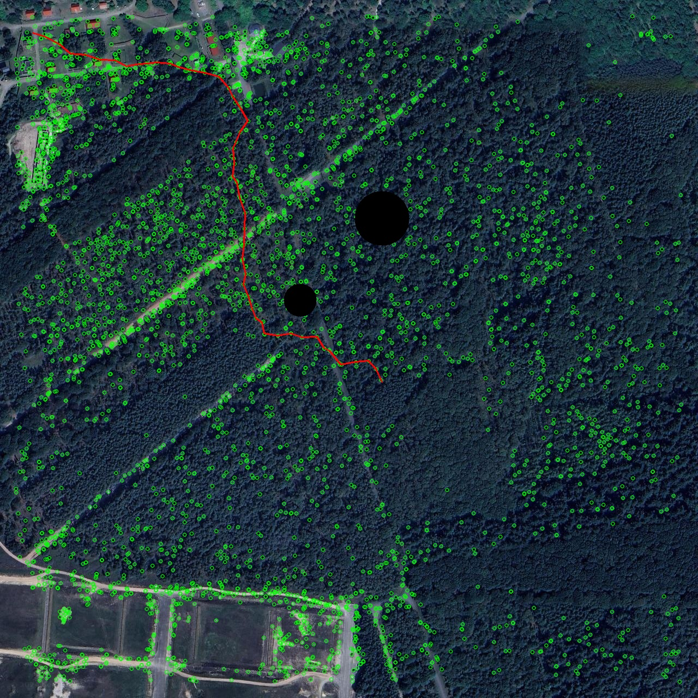
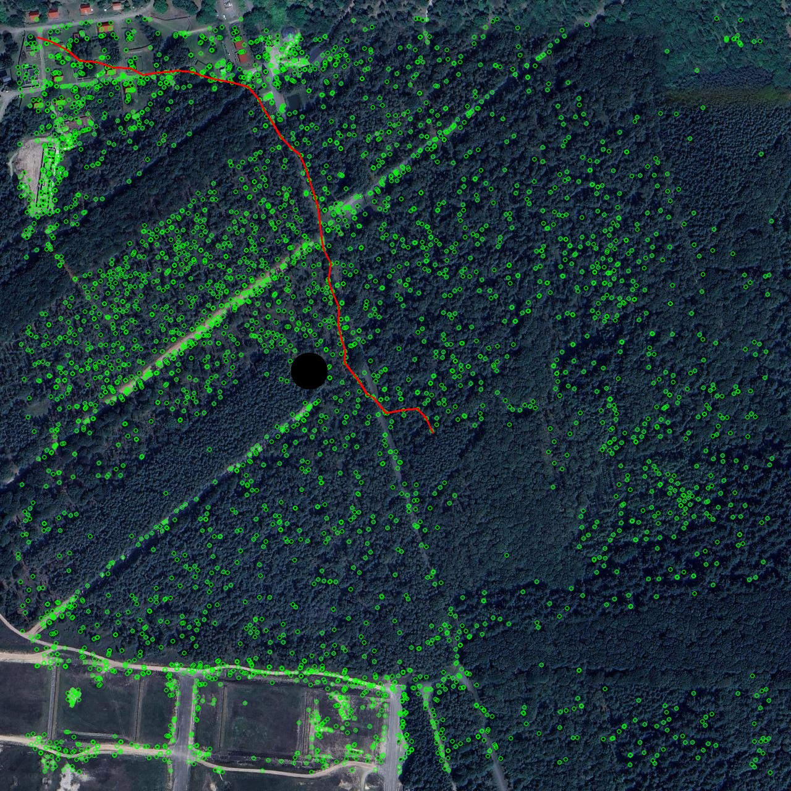
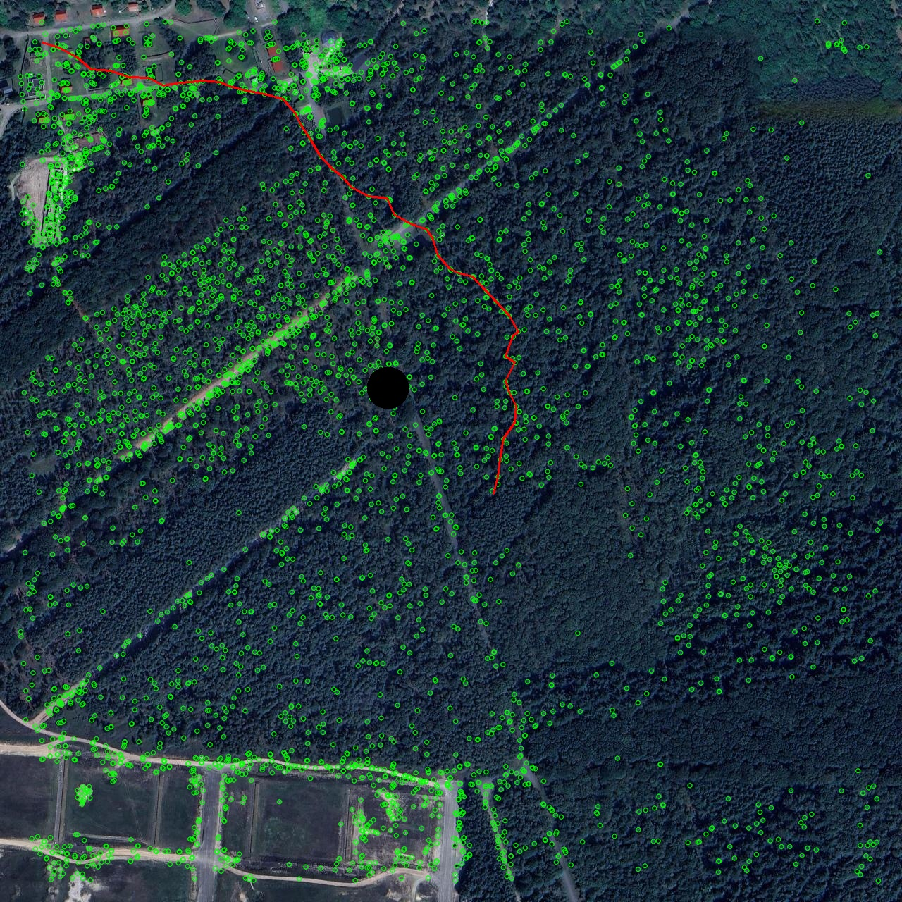

The project is related to solve path planning task on key points that were extracted from satellite images using AKAZE feature extractor

Here you can see how different algorithms perform:

A* (A-star) algorithm performance:

Djikstra's algorithm performance with 1 obstacle:

Djikstra's algorithm performance with 1 shifted obstacle:

Djikstra's algorithm performance with 2 obstacles:

